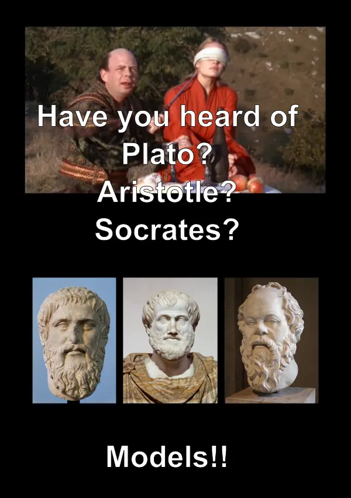

# Captioned Image - “Have you heard of Plato? Aristotle? Socrates?”

## Preview

## About

This repository contains the sources for a captioned image. To view or
edit it type:

    inkscape ./philosophers-princes-bride.svg

Busts of Plato, Aristotle and Socrates are taken from the [English Wikipedia](https://en.wikipedia.org/wiki/Main_Page).
Film still is from
[https://en.wikipedia.org/wiki/The\_Princess\_Bride\_%28film%29](https://en.wikipedia.org/wiki/The_Princess_Bride_%28film%29) .

[Explanation](https://www.shlomifish.org/humour.html#pbride_philosophers) .

## Creator

[Shlomi Fish](https://www.shlomifish.org/)
